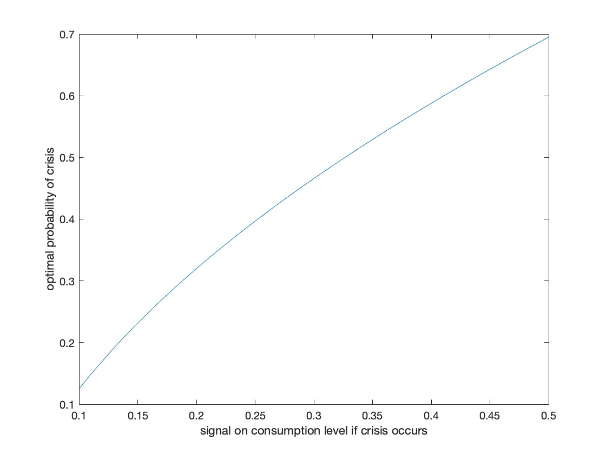

<!-- First: Set your default preferences for chunk options: -->

<!-- If you want a chunk's code to be printed, set echo = TRUE. message = FALSE stops R printing ugly package loading details in your final paper too. I also suggest setting warning = FALSE and checking for warnings in R, else you might find ugly warnings in your paper. -->

```{r setup, include=FALSE}
knitr::opts_chunk$set(echo = FALSE, message = FALSE, warning = FALSE, fig.width = 6, fig.height = 5, fig.pos="H", fig.pos = 'H')
# Note: Include = FALSE implies the code is executed, but not printed in your pdf.
# warning and message = FALSE implies ugly messages and warnings are removed from your pdf.
# These should be picked up when you execute the command chunks (code sections below) in your rmd, not printed in your paper!

# Lets load in example data, and see how this can be stored and later called from your 'data' folder.
if(!require("tidyverse")) install.packages("tidyverse")
library(tidyverse)
library(wordcountaddin)
word_count("MastersThesis.Rmd")
```


<!-- ############################## -->
<!-- # Start Writing here: -->
<!-- ############################## -->

# Introduction \label{Introduction}

(approx. 800)

The primary objective of this research assignment is to model how interactions in the political economy inhibit the advancement of environmental policies. Ultimately, we wish to understand how the frictions and dominance of certain countries in the global area impacts global environmental policy. For example, the US is a relatively smaller country with a large dominant role in the global arena that has a greater voting weight, compared to larger countries geographically with less dominance politically. This results in sub-optimal outcomes such as dominant countries contributing to pollution in larger countries that are geographically positioned in relatively more vulnerable positions.
The model we set up first considers the simplest case of a two-period optimisation problem. There is a world with abundant resources, where consumers believe that they can consume a lot today and tomorrow, and information about the state of the world is aggregated perfectly. As we continue to model this problem, frictions are added. 
For example, the state of the world may not be aggregated correctly to the voters. 
For our model, the focus is how the political system works when there is the issue of environmental degradation. Accordingly, the literature on both sides of the sustainability of the political economy is considered. Namely, the literature on exhaustible resources (including the optimal depletion thereof and the cake-eating optimisation problem) and the political economy (including the aggregation of political information and strategic voting).

The first specification of the state of the world will be modeled within a global economy in which there is only one population of voters and information is aggregated imperfectly. The second specification of the model will introduce the two-country setting and how adjustments to the bias of voter signals and the relative size of the countries may affect each country's citizens' voting decisions. Thereafter, the two specifications will be compared to each other to determine how co-operation between countries with regards to environmental policies may be disadvantageous for consumption and may make the probability of a crisis more likely.

#	Literature review 

(approx. 2000)

Pindyck (1978) models two optimal paths for using non-renewable resources depending on the initial resource endowment and the different marginal costs of extraction. If the initial reserve is large, then this will cause extraction costs to be low and thereby price will slowly rise over time. On the other hand, if the initial reserve has been depleted and is small, both the price and the extraction costs will be high. As reserves decline, the production cost for using resources increases and potential profits reduces. Accordingly, as marginal costs increase for extraction, producers will begin to conserve non-renewable resources because the marginal benefit thereof is smaller. Therefore, for non-renewable resources with a fixed reserve its time horizon can be increased with economic incentives such as profit opportunities that increase exploratory activity; “potential reserves” are unlimited. However, the model does not include the situation in which the non-renewable quantities are uncertain.

Kemp (1976) was the first to consider the cake-eating optimisation problem for an exhaustible resource of an unknown size and the idea has since been developed in the literature. Loury (1978) investigates the problem of optimal planning when faced with two issues in this regard; (i) the possibility of exhaustion of the resource, and (ii) learning about the distribution of reserves over time through exploration and extraction activities. Under certainty when a resource’s reserve is known, the possibility of exhaustion occurs only asymptotically. However, when the resource base is of unknown size, the date on which it will have been completely exploited is also a random variable. The choice of the rate of consumption is necessarily affected by the impact of the consumption rate on the probability of ‘crisis’, or likelihood of reaching the tipping point. Therefore, this paper demonstrates that the possibility of premature exhaustion alters the requirements of an optimal consumption path. The model used in the paper includes the date upon which the resource is exhausted as a choice variable and specifies some minimal level of resource consumption that is necessary to sustain an economy. “Set the objective function as the maximisation of the expected value of the integral of discounted utility. Employ dynamic programming techniques to deduce some comparative static results” The uncertain reserve is a random variable that is drawn from a cumulative density function. 

Kumar (2005) reconsiders Kemp’s use of an infinite planning horizon by instead using a hazard function which is defined as the probability of reaching the climate tipping point. The paper argues that ‘cake-eating under uncertainty’ has two main aspects: (i) optimal planning horizon and (ii) the characterisation of optimal program. The former aspect of the (i) optimal planning horizon can be assumed to extend far enough into the future to allow for the resource to be fully exhausted at some point. By employing a hazard function to model the problem, this planning horizon over which consumption of the exhaustible resource is positive has been found to be either finite or infinite. The findings of Kumar (2005) are that if an uncertain resource stock is finite and the optimal planning horizon is finite, hazard rates increase in unbounded fashion, and marginal utility of extraction and consumption at zero is finite. However, if an uncertain resource stock size is unbounded, the planning horizon is infinite. Thus, the optimal rate of extraction and consumption over time generally moves monotonically in the opposite direction to the hazard rate.

Adler & Treich (2017) consider additional elements that are not included in Kumar (2005) which are involved in the decision for optimal climate policy. There are three dimensions of climate policy modelled: (i) equity, (ii) time, and (iii) risk which each impact how risky consumption is allocated intertemporally. The cake-eating problem for an uncertain quantity of resources with a social planner allocating between the current and future generation is modelled in terms of three different social welfare functions. The first generation is given a determinate amount of consumption, but the second generation is given the risky remainder. The methodology used is a prioritarian social welfare function (SWF) which is the sum of some increasing, concave function of utility for the well-being of a generation. To find the optimal consumption allocation, Adler & Treich (2017) compare statics analysis for the different functions.

Lemoine & Traeger (2014) address the need to integrate policy with possibility of climate tipping points into a benchmark integrated assessment model” to analyse the intertemporal trade-offs that characterise climate policy decisions. Crossing the threshold shifts the world permanently to a new altered system with different dynamics to pre-threshold. The paper “analytically demonstrated that tipping points affect optimal policy via two channels: the differential welfare impact (DWI) recognizes that today's policy choices affect welfare in the case that a tipping point occurs, and the marginal hazard effect (MHE) recognizes that today's policy choices affect the probability of crossing the threshold.” endogenises welfare and probability of tipping point.

On the political economy side of the literature, Piketty (1999) provides a short survey of recent contributions to the literature related to political institutions as an information-aggregation mechanism. Condorcet (1785) was the first to posit that political institutions have a constructive role in efficiently aggregating information in a society. His main contribution to the literature was termed the ‘Condorcet Jury Theorem’ which states that under free elections, the probability that the the policy that is preferred by the majority will win by majority vote tends to one as the number of individuals in the population tends to infinity. This theorem posits democracy is an efficient  information-aggregation system if it is assumed that individuals are homogenous in their initial prior beliefs about the state of the world, each receives a signal drawn from the same conditional distribution and that it is realistic that more than half of citizens are right/ more than half of the time. 

Many models of political economy include different stages to analyse how voting impacts policies but vary according to how voters’ derive utility (Lohmann, 1994; Besley & Coate, 1998; Razin, 2003; Buchholz et al, 2005). Lohmann (1994) investigated the impact of the information aggregated by political action before a vote on whether votes cast are more or less accurate, where accuracy is defined in terms of reflecting voters’ preferences. The paper models that each individual has a loss function which dictates the loss if policy outcome is not what the individual desired and the private cost if the individual engaged in political action. The equilibrium point is where an individual’s political action strategy minimises her expected loss after the political action stage, and thus an individual only engages in political action if the cost of doing so is outweighed by the potential benefit of achieving the political outcome she wants.

Razin (2003) models elections with two potential candidates in a one-dimensional policy space. Voting behaviour is strategic as voters are motivated by both the election and signalling implications of voting.  Razin (2003) assumes that voters are privately and imperfectly informed about a common shock which impacts voters’ preferences. Voters’ private signals are drawn independently from a distribution and are conditional on the common shock. Razin (2003) also uses the policy gap idea (how far is the actual policy outcome from the voter’s preference/ideal) in a utility function.

To analyse voter behaviour, Lohmann (1994) uses game theoretical best responses at each stage are determined. For example, at the political action stage, their best response is a function of the ‘type’ of voter they are and the individual preferences they have. Razin (2003) also uses game theory with two stage process: First stage = common shock dictated by nature and voters receive and observe independent and private signals that are conditional upon this shock. Second stage = voters cast ballots simultaneously for either candidate L or R (cannot abstain from voting). Candidate with majority wins and chooses a policy according to votes (assuming candidates are responsive).

Buchholz et al (2005) investigates the policy outcome that may arise from international environmental agreements when governments are democratically elected by citizens. This paper considers two pertinent themes, namely the case in which a voter may be incentivised to support a political candidate who is less environmentally inclined than the voter’s own preferences and the case in which the elected candidate pays no attention to environmental policies and thus international agreements are rendered ineffective. The paper argues that efficient allocation of resources in a sustainable way requires co-operation between countries but that there is a far way to go before international environmental agreements are fully enforced and functional. A possible reason for ineffective IEAs is that voters are incentivised to deliberately support candidates with different environmental preferences to their own in order to improve their country’s bargaining position in international negotiations. 

Methodology is to use median-voter approach (“If all voters have single-peaked preferences then the alternative that is the most preferred by the median voter will defeat any other alternative in a pairwise majority vote. See also voting.”) with Nash bargaining in simple two country model to understand the effects of democratically elected governments on IEAs’ effectiveness. In first stage, citizens from both countries elect politicians and then in second stage, the elected politicians negotiate over reducing pollution/environmental policies. In the third stage, if agreement reached then IEA becomes binding but otherwise, countries independently choose policies and accordingly defines a threat point for bargaining.

The main conclusion is that each voter supports a candidate that is less environmentally conscious than they are because conducting strategic voting improves their country’s bargaining position, which is due to the free-rider problem that simply moves from the politicians to the voters. The paper compares the isolationist case in which there is no IEA between countries to the bargaining or co-operative case with an IEA and finds that countries will be incentivised to improve their bargaining position in an IEA by introducing less green policies, than they would otherwise in a unilateral arrangement.

The paper models the electoral system in a stylised way which means that the winning candidate is determined when they win every pairwise comparison with all other candidates and assumed that the competing candidates have different types ranging between 0 and 1.
On the other hand, Besley & Coate (1998) set up a model of representative democracy in which citizens are all able to avail themselves as candidates to run for public office. The model assumes that candidates must credibly commit to implementing their preferred policy if they win the election and voters vote accordingly. Voters derive utility from the ultimate policy outcome and the winning candidate’s identity, and derive disutility from the cost of running for office if they decide to do so. There is strategic voting because voters’ voting decisions are optimal if they are a best response, given the rest of voters’ decisions. The paper defines the equilibrium policy choice as efficient according to a Pareto optimal definition; if there are no alternative policy choices in the present period that could increase the expected utility of all citizens conditional on future policies that are democratic in nature. However, this model assumes complete information. It recommends that future research incorporates uncertainty regarding voters’ preferences and endogenises the formation of parties or candidates that run for office.

#	Model set-up of sustainable consumption in global economy
The first specification of the model will be set up in a global economy in which there is only one population of voters and information is aggregated imperfectly. Voters are uncertain about the true penalty that the economy will face if consumption today exceeds some threshold. First, the economy will be specified and thereafter, the consumer problem and voting decision-making process will be presented. 

## Economy {-}
In order to model sustainability in the political economy, we first set up a simple model of sustainable consumption over two periods $t = 1, 2$. The choice variable in this economy is consumption in period one ($c_1$) and consumption in period two ($c_2$) is stochastic and dependent on the value of $c_1$ as follows. $c_1$ is defined as sustainable if it is below an unknown threshold value ($\tilde{c}$). This is because if $c_1$ is sustainable, then $c_2$ can also be set at the same level ($c_1$ = $c_2$). However, if $c_1$ is unsustainable, and exceeds $\tilde{c}$ in period one, then the economy will face some penalty in period two ($\underline{c}$) and $c_2$ will be much lower than $c_1$ as a result ($c_1> \underline{c}$). Thus, we can model $c_2$ as a function of $c_1$ as follows:

$$
c_2\left(c_1\right)= \begin{cases}c_1 & \text { if } c_1 \leq \tilde{c} \\ \underline{c} & \text { otherwise }\end{cases}
$$

## Consumers {-}

The decision problem faced by consumers in the global economy is to maximise their lifetime utility by their choice of $c_1$ 

$$
U\left(c_1\right)=u\left(c_1\right)+\mathbb{E} u\left(c_2\left(c_1\right)\right)
$$

and is subject to the constraint that it should not exceed $\tilde{c}$ and be set between the lowest threshold ($c_L$) and the highest threshold ($c_H$).  In this setting, $c_L$ represents the safest level of consumption at which the probability of a crisis is zero. This may be considered to be the very lowest consumption that is required to continue living (ref?). On the other hand, $c_H$ represents the maximum consumption value that may be consumed in period one without incurring a penalty and thus represents a "tipping point" (Lemoine & Traeger**) which once it is exceeded, the probability of a crisis is one. If consumers had perfect information, the optimal choice of $c_1$ should be set at $c_H$ to maximise consumption in both period one and period two by ensuring that $c_1$ is sustainable.

$$
\operatorname{Pr}\left(\tilde{c} \leq c_1\right)=\left\{\begin{array}{cc}
0 & \text { if } c_1 \leq c_L \\
\frac{c_1-c_L}{c_H-c_L} & \text { if } c_1 \in\left(c_L, c_H\right] \\
1 & \text { otherwise }
\end{array}\right.
$$

where the utility derived from consumption is assumed to take the relative risk aversion functional form and $\rho$ is assumed to be 1.5.

$$
U(C)=\frac{c^{1-\rho}-1}{1-\rho}
$$

Due to the uncertainty in the consumer problem, because there is a lack of consensus regarding how likely climate crisis is (ref??), consumers hold beliefs about the optimal level of consumption in period one and the probability of crisis at that level of consumption. These beliefs are determined by private signals $\hat{\underline{c}}_k$ that consumers receive which are noisy and conceal the true value $\underline{c}$, ie information aggregation is not perfect/efficient.

$$
\hat{\underline{c}}_k=\underline{c}+\varepsilon_k
$$

where  $\mathbb{E}\left(\varepsilon_k\right)=0$ and it is assumed that $\hat{\underline{c}}_k$ are drawn from a uniform distribution between $c_L$ and $c_H$. From the signals that are drawn randomly for each individual, there are different associated optimal probability of crisis points. In other words, the different signals that individuals draw determine their belief about which probability of crisis is optimal, and thus lifetime utility constitutes the utility derived from period one consumption a the expected utility of the weighted probability average of period two consumption as follows: 

$$
U\left(c_1 \mid \hat{\underline{c}}_{k}\right)=u\left(c_1\right)+\operatorname{Pr}\left(\tilde{c} \leq c_1\right) u\left(\hat{\underline{c}}_{k}\right)+\left(1-\operatorname{Pr}\left(\tilde{c} \leq c_1\right)\right) u\left(c_1\right)
$$

This is a realistic assumption because in the real world consumers are exposed to a variety of news sources (noisy) and different news headlines which each predict different outcomes for the climate in the future (*ref). In this model, the thresholds of consumption in period one are set as exogenous parameters, and are set to $c_L$ = 0.5 and $c_H$ = 1.5 respectively. _To alter the thresholds of consumption could yield different results but beyond the scope of this paper_. 

For example, Figure 1 shows the cumulative density function of the probability of crisis and it indicates that individuals who receive higher signals hold a more optimistic belief about how bad the climate crisis may be, as they believe that the probability of a climate crisis occurring can be greater at the optimum point. An individual’s optimal probability of crisis depends on the signal provided to the individual. The higher the signal, the higher the optimal consumption point and thus the higher the optimal probability of crisis. This is realistic because individual’s that have been provided with information that indicates that climate crisis is unlikely will consume more and thus be comfortable with a higher probability of crisis.

\begin{center}
Figure 1
\end{center}
{align=center}{width=10cm}

This is key in this story. How big of a risk do citizens believe to be optimal/okay?

## Voters {-}
According to the median voter theorem, if preferences are single peaked (which is implied by the uniformly distributed signals that determine preferences and beliefs about the probability of crisis) then the median voter will be the winning candidate in a vote, if we assume voter sincerity (*ref). 

#	A simple model of sustainable consumption in two-country economy

The impact of another country may impact the optimal level of consumption in period one. More realistic to consider countries’ interdependent impact, for example in IEAs.
Buchholz et al (2005) reaches an analytical result in which voters may be incentivised to vote for less green candidates in order to improve their own country’s bargaining position when there is an IEA, which implies that unless there is full co-operation, any bargaining outcome is bad for environmental policy and the probability of a climate crisis.
Buchholz et al (2005) compares the isolationist case against the bargaining case with an IEA implemented between two countries to analyse the impact of IEAs on environmental policy. Similarly, this paper compares the global democracy of one global economy against the Nash equilibrium solution found in the case of two countries which bargain together as in an IEA.
As in Besley & Coate (1998) there is uncertainty regarding the worst case scenario as there are different signals and different associated probabilities of crisis. This paper also suggests that non-co-operation with other countries may yield a greater expected utility than if co-operation occurs. 
Besley & Coate (1998) finds that according to the median voter result and Condorcet Jury theorem, there is one ultimate winner
Besley& Coate voters voting decisions are their best response given the rest of voters decisions. Use the same assumption that candidates cannot credibly commit to any other policy other than their own policy preference and voters know this, which is realistic.
Unlike Besley & Coate (1998) which accounts for the policy outcome and winning candidate’s identity as providing utility and the cost of running for office as providing disutility, our model simplifies away the cost of running for office to simply understand how international co-operation may move countries away from better climate policy outcomes than if they acted unilaterally. Instead, our model builds on Besley by not selecting candidates exogenously and instead assuming complete info and instead using imperfect and unique signals that are randomly provided to each voter. 
First, split the global democracy and individual’s signals into two different populations; divide them probabilistically into country A and country B so as to ensure random splitting.

For now, we assume simple majority voting
Compute expected utilities for every possible candidate:
each citizen runs for election, promising to implement their their ideal consumption
each voter considers any pairwise competition based on the expected utility they will obtain if the either candidate implements their promise
First step: find the expected utility of each citizen under the regime of each other citizen. The row's contain the different choices of c1 of the different options for citizen-governor. The columns represent the experience (expected utility) of the different citizens based on their beliefs about c_.

Next, find the mutual best responses
Find the Nash equilibrium


Variations in country share and bias
prob of being in country A = country A share + bias(cdf of signal - country A share)


# Discussion and results 

(approx 1000)

Are imbalances good or bad????
Unless there is full co-operation, any bargaining is sub-optimal

## 0.1 Country A share 0 Bias {-}
N_A = 104, N_B = 896
c_average_NE = 1.0363
prob_crisis_NE =0.5363

## 0.5 Country A share and 0 Bias {-}
For the base case, the share of each country is 50/50. There is no bias introduced. Both countries receive signals that are uniformly and normally distributed.

Size of country A is 484 and country B is 516
c_average_NE =1.2134
prob_crisis_NE = 0.7134

## 0.5 Country A share 0.9 Bias {-}
N_A =   523 N_B =  477
c_average_NE =  1.2234
prob_crisis_NE =0.7234


Kemp (1976) comparative static results 


\begin{center}
Table 2: Model comparison
\end{center}
```{r table2, echo=FALSE, message=FALSE, warnings=FALSE, results='asis'}
tabl2 <- "
|                        |Period 1 consumption|Probability of crisis |
|------------------------|:------------------:|:--------------------:|
|Global democracy        | 0.9499             |0.4499                |                
|Two countries 0.1 share | 1.0363             |0.5363                |            
|Two countries 0.5 share | 1.2134             |0.7134                |
|Two countries 0.9 bias  | 1.2234             |0.7234                |
"
cat(tabl2)
```


```{r Figure1,  warning =  FALSE, fig.align = 'center', fig.cap = "Caption Here \\label{Figure1}", fig.ext = 'png', fig.height = 3, fig.width = 6}

```

# Conclusion


\newpage

# References {-}


