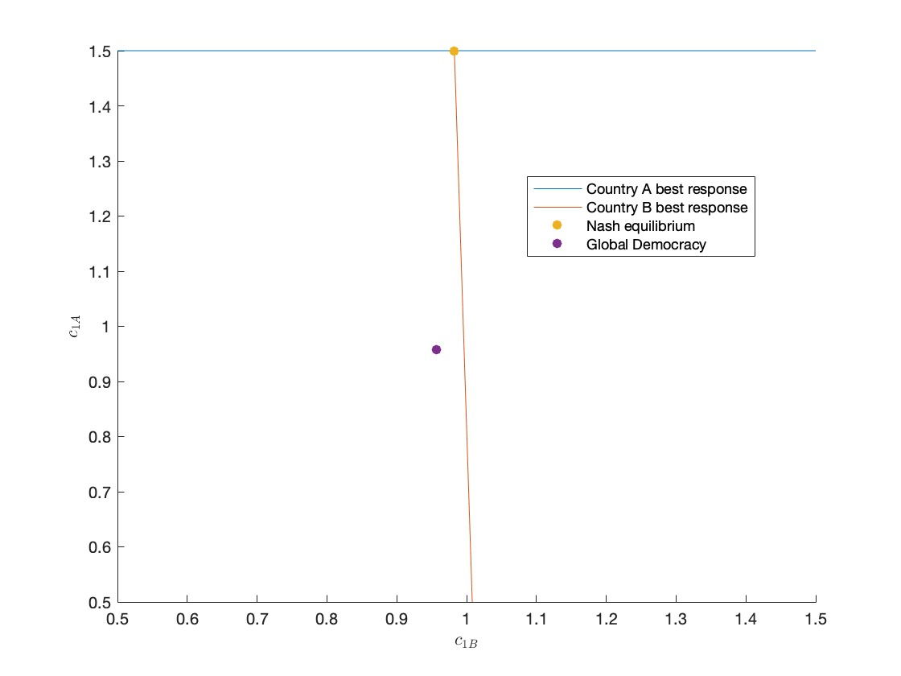
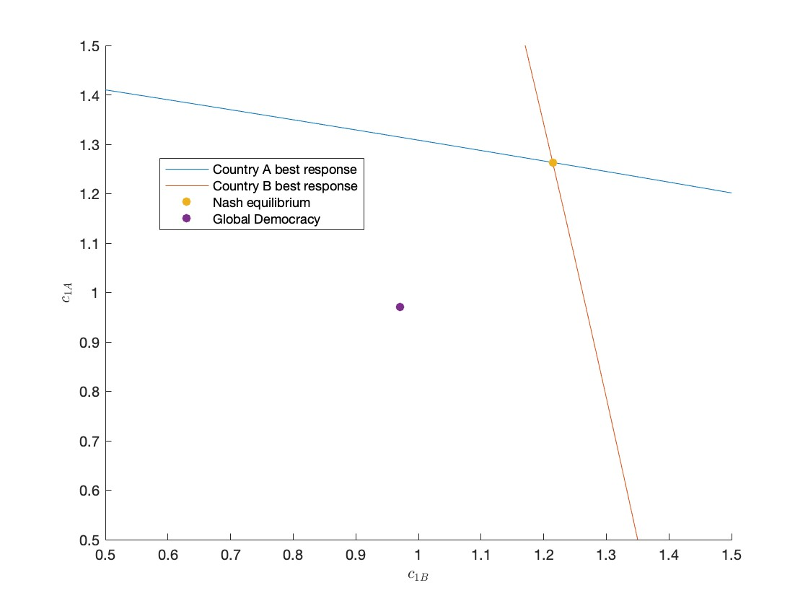
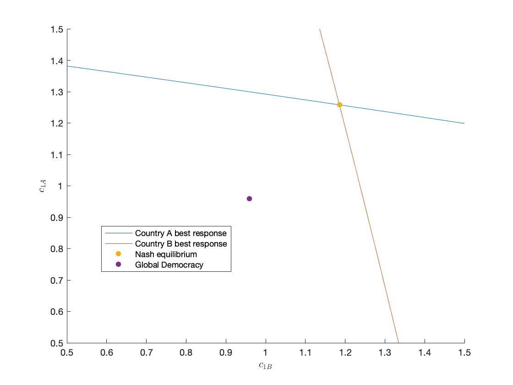
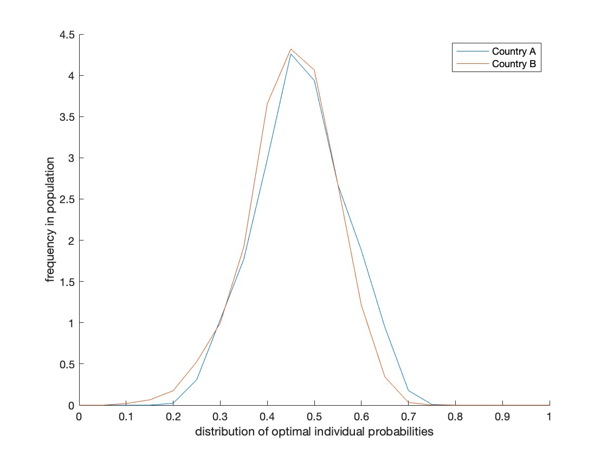
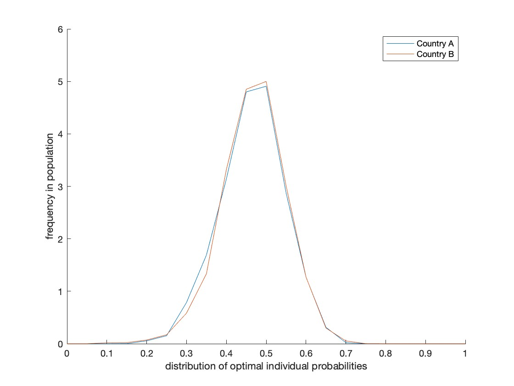
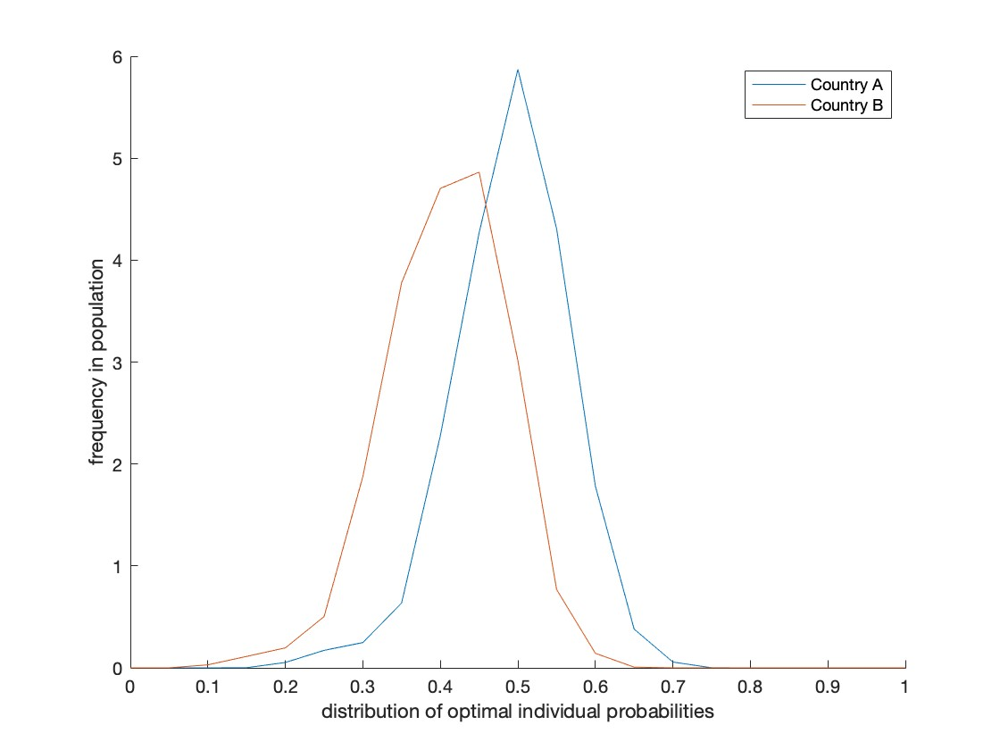

<!-- First: Set your default preferences for chunk options: -->

<!-- If you want a chunk's code to be printed, set echo = TRUE. message = FALSE stops R printing ugly package loading details in your final paper too. I also suggest setting warning = FALSE and checking for warnings in R, else you might find ugly warnings in your paper. -->

```{r setup, include=FALSE}
knitr::opts_chunk$set(echo = FALSE, message = FALSE, warning = FALSE, fig.width = 6, fig.height = 5, fig.pos="H", fig.pos = 'H', fig.align = 'center')
# Note: Include = FALSE implies the code is executed, but not printed in your pdf.
# warning and message = FALSE implies ugly messages and warnings are removed from your pdf.
# These should be picked up when you execute the command chunks (code sections below) in your rmd, not printed in your paper!

# Lets load in example data, and see how this can be stored and later called from your 'data' folder.
if(!require("tidyverse")) install.packages("tidyverse")
library(tidyverse)
library(wordcountaddin)
word_count("MastersThesis.Rmd")
```


<!-- ############################## -->
<!-- # Start Writing here: -->
<!-- ############################## -->

# Introduction \label{Introduction}

(approx. 800)

There have been many agreements entered into between countries, such as the Montreal protocol, which have fallen short of objectives and prevent an effective reduction in climate change (Buccholz _et al._, 2005). Some papers suggest that IEAs are ineffective because of strategic voting by voters to ensure their own country's bargaining position is stronger (Buccholz _et al._, 2005). Our paper suggests that this may be the case if voters take into account the impact of another country's consumption level into their own best response function. This is made evident by the finding that when two countries are of a similar size, the Nash equilibrium outcome yields a much higher consumption level and probability of crisis than when one country is much larger than the other.

efficient allocation of non-renewable resources that considers sustainability in the political economy requires co-operation among countries (Buccholz _et al._, 2005)

if perfect co-operation cannot be ensured, then it may be better to allow countries to unilaterally set their own environmental policies, as this may yield greener winning political candidates, reduce pollution, and provide a higher payoff for the median voter (Buccholz _et al._, 2005) HOW TO ENSURE CREDIBLE COMMITMENT TO COUNTRY'S TRUE POLICY PREFERENCES? (Buccholz _et al._, 2005) ASKS THE QUESTION


The primary objective of this research assignment is to model how interactions in the political economy inhibit the advancement of environmental policies. Ultimately, we wish to understand how the frictions and dominance of certain countries in the global area impacts global environmental policy. For example, the US is a relatively smaller country with a large dominant role in the global arena that has a greater voting weight, compared to larger countries geographically with less dominance politically. This results in sub-optimal outcomes such as dominant countries contributing to pollution in larger countries that are geographically positioned in relatively more vulnerable positions.

The model we set up first considers the simplest case of a two-period optimisation problem. There is a world with abundant resources, where consumers believe that they can consume a lot today and tomorrow, and information about the state of the world is aggregated perfectly. As we continue to model this problem, frictions are added. 
For example, the state of the world may not be aggregated correctly to the voters. 
For our model, the focus is how the political system works when there is the issue of environmental degradation. Accordingly, the literature on both sides of the sustainability of the political economy is considered. Namely, the literature on exhaustible resources (including the optimal depletion thereof and the cake-eating optimisation problem) and the political economy (including the aggregation of political information and strategic voting).

The first specification of the state of the world will be modeled within a global economy in which there is only one population of voters and information is aggregated imperfectly. The second specification of the model will introduce the two-country setting and how adjustments to the bias of voter signals and the relative size of the countries may affect each country's citizens' voting decisions. Thereafter, the two specifications will be compared to each other to determine how co-operation between countries with regards to environmental policies may be disadvantageous for consumption and may make the probability of a crisis more likely.

#	Literature review 

(approx. 2000, currently 2100)

The literature which models the utilisation and extraction of non-renewable resources began with contributions that did not incorporate uncertainties (Pindyck, 1978). Thereafter, it developed to consider the impact of consumption in the present period on the resources remaining for the following period (Adler & Treich, 2017), and ultimately began to incorporate the possibility of consumption in the present period as a determinant of the probability of crisis (Loury, 1978; Kumar, 2005; Lemoine & Traeger, 2014). 

Pindyck (1978) models two different optimal paths for using non-renewable resources which depends on the initial resource endowment and the different marginal costs of extraction for different resources. If the initial reserve endowment is large, then this causes extraction costs to be low and thereby the price will slowly rise over time as the resource depletes. On the other hand, if the initial reserve has already been depleted and there is only a small quantity remaining, both the price and the extraction costs will be high. As reserves decline, the production cost for using resources increases and potential profits reduces. Accordingly, as marginal costs increase for extraction, producers will begin to conserve non-renewable resources because the marginal benefit thereof is smaller. Pindyck (1978) can be incorporated into a model of sustainable consumption by modelling that there is a cost in the future if consumption in the present period is too high. Consumption of resources is thus only sustainable if consumption in the present period does not impose a cost in the next period. However, the model in this paper does not consider the more realistic situation in which the non-renewable resource quantities are uncertain and thus does not address the possibility of exhausting a resource in its entirety.

Adler & Treich (2017) consider three dimensions of climate policy to be modelled: (i) equity, (ii) time, and (iii) risk which each impact how risky consumption is allocated intertemporally. These three dimensions can be interpreted as beliefs which are used in our model to inform the optimal level of consumption and probability of crisis. The cake-eating problem for an uncertain quantity of resources with a social planner who allocates between the current and future generation is modelled in terms of three different social welfare functions. The first generation is given a determinate amount of consumption, but the second generation is given the risky remainder. Our model also includes only the first period's consumption as the choice variable which then impacts the second period, but instead of first period consumption directly impacting what is remaining for the next period, in our model consumption impacts the probability of crisis. The methodology used is a prioritarian social welfare function (SWF) which is the sum of some increasing, concave function of utility for the well-being of a generation. To find the optimal consumption allocation, Adler & Treich (2017) compare statics analysis for the different functions.

However, these aforemetioned papers do not consider the uncertain thresholds which cannot be exceeded without incurring a cost, more specifically without altering the trajectory of an economy permanently ie crisis. Kemp (1976) was the first to consider the cake-eating optimisation problem for an non-renewable resource of an unknown size and has since been developed in the literature. Loury (1978) investigates the optimal planning for an economy faced with two main problems; (i) the possibility of exhaustion of the resource, and (ii) learning about the distribution of reserves over time through exploration and extraction activities. Under certainty, when the size of the resource reserve is known, the possibility of exhaustion occurs only asymptotically. However, when the resource reserve quantity is of unknown size, the date upon which it will have been completely exploited is also a random variable. The choice of the rate of consumption is necessarily affected by the impact of the consumption rate on the probability of crisis, or likelihood of reaching the tipping point. This feature is incorporated directly into our model as the consumption in period one which is believed to be optimal directly determines individual's beliefs regarding the optimal probability of crisis, and thus affects the choice of consumption. Loury (1978) demonstrates that the possibility of premature exhaustion alters the requirements of an optimal consumption path. Moreover, the model used in this paper specifies some minimal level of resource consumption that is necessary to sustain an economy, which is incorporated into our model as the lower consumption threshold, and the uncertain reserve of resources is a random variable that is drawn from a cumulative density function, which is a mechanism that our model employs to draw unknown values. 

Kumar (2005) reconsiders Kemp’s use of an infinite planning horizon by instead using a hazard function which is defined as the probability of reaching the climate tipping point. The paper argues that ‘cake-eating under uncertainty’ has two main aspects: (i) optimal planning horizon and (ii) the characterisation of optimal program. The former aspect of the (i) optimal planning horizon can be assumed to extend far enough into the future to allow for the resource to be fully exhausted at some point. By employing a hazard function to model the problem, the planning horizon over which consumption of the exhaustible resource is positive has been found to be either finite or infinite. The main findings of Kumar (2005) are that if an uncertain resource stock is finite and the optimal planning horizon is finite, hazard rates increase in unbounded fashion, and marginal utility of extraction and consumption at zero is finite. However, if an uncertain resource stock size is unbounded, the planning horizon is infinite. Thus, the optimal rate of extraction and consumption over time generally moves monotonically in the opposite direction to the hazard rate.

Lemoine & Traeger (2014) addresses the need to integrate policy with possibility of climate tipping points into a benchmark integrated assessment model to analyse the intertemporal trade-offs which characterise climate policy decisions. Crossing the threshold shifts the world permanently to a new altered system with different dynamics to the state of the world pre-threshold. The paper demonstrates with an analytical model that optimal policy is impacted by tipping points via two channels; namely (the differential welfare impact (DWI) recognizes that the present period's policy choices affect  (i) welfare if a tipping point occurs, and (ii) the probability of crossing the threshold. Accordingly, the paper's model endogenises welfare and the probability of tipping point, which our model incorporates.

On the political economy side of the literature, Piketty (1999) provides a short summary of recent contributions to the literature related to political institutions as an information-aggregation mechanism. Condorcet (1785) was the first to posit that political institutions have a constructive role in efficiently aggregating information in a society. His main contribution to the literature was termed the ‘Condorcet Jury Theorem’ which states that under free elections, the probability that the policy that is preferred by the majority will win by majority vote tends to one as the number of individuals in the population tends to infinity. This theorem posits that democracy is an efficient information-aggregation system if it is assumed that individuals are homogenous in both their initial prior beliefs about the state of the world and their utility functions. Condorcet also assumed voters vote sincerly in accordance with their beliefs and do not engage in strategic voting. Towards the end of the twentieth century, formal political models began including information economics, and may indicate a return to the approach of Condorcet. Extensions of the Condorcet model incorporated the more realistic nature of information in an economy; information is never fully integrated, but rather exists in an economy as dispersed, incomplete and often contradictory pieces. Thus, it has since been modelled that each individual receives a signal drawn from the same conditional distribution, which has been used in developing our model.  

Many models of political economy include different stages to analyse how voting impacts policies but vary according to how voters’ derive utility (Lohmann, 1994; Besley & Coate, 1998; Razin, 2003; Buchholz _et al._, 2005). Our model does not include voting stages, but instead models two stages of resource consumption, and draws different aspects from the following papers. Lohmann (1994) investigated the impact of the information aggregated by political action on whether votes are more or less accurate, where accuracy is defined in terms of reflecting voters’ preferences. The paper models that each individual has a loss function which accounts for the loss if the policy outcome is not what the individual desired and the private cost if the individual engaged in political action. The equilibrium point is where an individual’s political action strategy minimises her expected loss after the political action stage. To analyse voter behaviour, Lohmann (1994) uses game theoretical best responses at each voting stage. For example, at the political action stage, a voter's best response is a function of the ‘type’ of voter that they are and the individual preferences which they have. Similarly, our model uses best response functions for voting behaviour but omits the consideration of voter types, as voters are distinguished only by their private signals.

Razin (2003) models elections with only two potential candidates in a one-dimensional policy space. Voting behaviour is strategic as voters are motivated by both the election and signalling implications of voting. Election motivations refer to voters deciding to vote to influence which candidate wins the vote, whereas signalling motivation refers to voters voting to influence which policy the winning candidate will implement. In our model, it is assumed instead that the winning candidate will credibly commit to implementing their own preferred policy and voters may engage in strategic voting to bolster their own country's bargaining position in the two-country model. Razin (2003) assumes that voters are privately and imperfectly informed about a common shock which impacts voters’ preferences. Voters’ private signals are drawn independently from a distribution and are conditional on the common shock. Our model adopts the same mechanism to determine voters' beliefs, albeit without the inclusion of a common shock to the economy. 

Buchholz _et al_ (2005) investigates the policy outcome that may arise from international environmental agreements when governments are democratically elected by citizens. This paper considers two pertinent themes, namely the case in which a voter may be incentivised to support a political candidate who is less environmentally inclined than the voter’s own preferences and the case in which the elected candidate pays no attention to environmental policies and thus international agreements are rendered as ineffective. The paper argues that an efficient allocation of resources in a sustainable way requires co-operation between countries but that there is a far way to go before international environmental agreements are fully enforced to function as they are intended. A possible reason for ineffective IEAs is that voters are incentivised to deliberately support candidates with different environmental preferences to their own in order to improve their country’s bargaining position in international negotiations. Our paper investigates a very similar research question and adopts a similar methodology in our model. However, Buccholz _et al._ (2005) provides attention to varying degrees of transboundary pollution, which refers to one country's polluting impact on another country, whereas our paper focuses more on the impact of varying the size of countries and introducing biased beliefs to assess how this may impact the voting in a two-country model.

" A candidate comes into power when she wins every pairwise comparison with country. For analytical convenience, the electorate is assumed continuous choice of competing politicians' types from the this majority-rule process. This range of candidates' types coincides variety of attitudes in the population" Buchholz _et al_ (2005)

"international agreements might be counterproductive if strategic voting takes place"

Buchholz _et al_ (2005) suggests to overcome the lack of co-operation, could create mandatory side-payments that must be paid by the country that induces pollution in the other country to the other country to account for the negative externality which would adjust voters and politicans payoffs to consider environmental degradation more directly and thus lead to better co-operative outcomes. But in their model they include the trade-off between domestic product and environmental policies, so would not improve our models outcomes, would require a different specification

Buchholz _et al_ (2005) finds that compared to the median outcome, co-operating governments care less about environmental outcomes

Methodology is to use median-voter approach (“If all voters have single-peaked preferences then the alternative that is the most preferred by the median voter will defeat any other alternative in a pairwise majority vote. See also voting.”) with Nash bargaining in simple two country model to understand the effects of democratically elected governments on IEAs’ effectiveness. In first stage, citizens from both countries elect politicians and then in second stage, the elected politicians negotiate over reducing pollution/environmental policies. In the third stage, if agreement reached then IEA becomes binding but otherwise, countries independently choose policies and accordingly defines a threat point for bargaining.

The main conclusion is that each voter supports a candidate that is less environmentally conscious than they are because conducting strategic voting improves their country’s bargaining position, which is due to the free-rider problem that simply moves from the politicians to the voters. The paper compares the isolationist case in which there is no IEA between countries to the bargaining or co-operative case with an IEA and finds that countries will be incentivised to improve their bargaining position in an IEA by introducing less green policies, than they would otherwise in a unilateral arrangement.

The paper models the electoral system in a stylised way which means that the winning candidate is determined when they win every pairwise comparison with all other candidates and assumed that the competing candidates have different types ranging between 0 and 1.
On the other hand, Besley & Coate (1998) set up a model of representative democracy in which citizens are all able to avail themselves as candidates to run for public office. The model assumes that candidates must credibly commit to implementing their preferred policy if they win the election and voters vote accordingly. Voters derive utility from the ultimate policy outcome and the winning candidate’s identity, and derive disutility from the cost of running for office if they decide to do so. There is strategic voting because voters’ voting decisions are optimal if they are a best response, given the rest of voters’ decisions. The paper defines the equilibrium policy choice as efficient according to a Pareto optimal definition; if there are no alternative policy choices in the present period that could increase the expected utility of all citizens conditional on future policies that are democratic in nature. However, this model assumes complete information. It recommends that future research incorporates uncertainty regarding voters’ preferences and endogenises the formation of parties or candidates that run for office. Unlike Besley & Coate (1998) which accounts for the policy outcome and winning candidate’s identity as providing utility and the cost of running for office as providing disutility, our model simplifies away the cost of running for office to simply understand how international co-operation may move countries away from better climate policy outcomes than if they acted unilaterally. 

#	Model set-up of sustainable consumption in global democracy

(approx 1250)

The first specification of the model will be set up in a global economy in which there is only one population of voters in the global democracy. Information is aggregated imperfectly. Voters are uncertain about the true penalty that the economy will face if consumption today exceeds some threshold. The model is simulated in Matlab and thereafter is optimised in the programme to find optima. First, the economy will be specified and thereafter, the consumer problem and voting decision-making process will be presented. 

## Economy {-}
In order to model sustainability in the political economy, we first set up a simple model of sustainable consumption over two periods $t = 1, 2$. The choice variable in this economy is consumption in period one ($c_1$). Consumption in period two ($c_2$) is stochastic and dependent on the value of $c_1$ as follows. $c_1$ is defined as sustainable if it is below an unknown threshold value ($\tilde{c}$). This is because if $c_1$ is sustainable, then $c_2$ can also be set at the same level ($c_1$ = $c_2$). However, if $c_1$ is unsustainable, and exceeds $\tilde{c}$ in period one, then the economy will face some penalty in period two ($\underline{c}$). As a result, $c_2$ will be much lower than $c_1$ ($c_1> \underline{c}$). Thus, we can model $c_2$ as a function of $c_1$ as follows:

$$
c_2\left(c_1\right)= \begin{cases}c_1 & \text { if } c_1 \leq \tilde{c} \\ \underline{c} & \text { otherwise }\end{cases}
$$

## Consumers in discrete world {-}

The decision problem faced by consumers in the global democracy is to maximise their lifetime utility as follows:

$$
U\left(c_1\right)=u\left(c_1\right)+\mathbb{E} u\left(c_2\left(c_1\right)\right)
$$
subject to $c_1 \leq \tilde{c}$ and $c_L \leq c_1 \leq c_H$

In this problem, consumers' choice of $c_1$ is subject to the constraint that it should not exceed $\tilde{c}$ and be set between the lowest threshold ($c_L$) and the highest threshold ($c_H$). If consumers had perfect information, the optimal choice of $c_1$ should be set at $c_H$ to maximise consumption in both period one and period two by ensuring that $c_1$ is sustainable. 

## Consumers in continuous world {-}

However, to develop the model further we introduce the probability of crisis (Loury, 1978). In this setting, $c_L$ represents the safest level of consumption at which the probability of a crisis is zero. This can be regarded as some minimal level of resource consumption that is necessary to sustain an economy or the very least that is required to continue living (Loury, 1978). On the other hand, $c_H$ represents the maximum consumption value that may be consumed in period one at which the probability of crisis is one. This can be regarded as some upper bound of consumption possibilities where it is certain that the threshold $\tilde{c}$ will be reached. Due to the uncertain value of $\tilde{c}$ that is drawn from a uniform distribution between $c_L$ and $c_H$, $c_H$ thus represents a certainty of reaching the "tipping point" (Kumar, 2005; Lemoine & Traeger, 2014). Accordingly, if this unknown threshold $\tilde{c}$ is exceeded, the crisis occurs below $c_H$. 

$$
\operatorname{Pr}\left(\tilde{c} \leq c_1\right)=\left\{\begin{array}{cc}
0 & \text { if } c_1 \leq c_L \\
\frac{c_1-c_L}{c_H-c_L} & \text { if } c_1 \in\left(c_L, c_H\right] \\
1 & \text { otherwise }
\end{array}\right.
$$

We make the assumption that the utility function of all consumers homogenous (Piketty, 1999) is as follows:
$$
U(C)=\frac{c^{1-\rho}-1}{1-\rho}
$$
where the utility derived from consumption is assumed to take the relative risk aversion functional form and $\rho$ is assumed to be set at 1.5.

Due to the uncertainty in the consumer problem, because there is a lack of consensus regarding how likely climate crisis is, consumers hold beliefs about the optimal level of consumption in period one $c_1$ and the probability of crisis at that level of consumption. As in Besley & Coate (1998) there is uncertainty regarding the worst case scenario (how bad the crisis will be) and the true optimal level of consumption, there are different beliefs across individuals. These beliefs are determined by private signals $\hat{\underline{c}}_k$ that consumers receive.

$$
\hat{\underline{c}}_k=\underline{c}+\varepsilon_k
$$

where  $\mathbb{E}\left(\varepsilon_k\right)=0$ and it is assumed that $\hat{\underline{c}}_k$ are drawn from a uniform distribution between $c_L$ and $c_H$. These signals are noisy and conceal the true value of $\underline{c}$, and thus information aggregation is not perfect in this model. This is a realistic assumption because in the real world consumers are exposed to a variety of news sources and political action which each suggest different probabilities for future climate outcomes (Piketty, 1999; Lohmann, 1994). From the signals that are drawn randomly for each individual, there are different associated optimal probability of crisis points. In other words, the different signals that individuals draw determine their belief about which probability of crisis is optimal, and thus lifetime utility constitutes the utility derived from period one consumption and the expected utility of the weighted probability average of period two consumption as follows: 

$$
U\left(c_1 \mid \hat{\underline{c}}_{k}\right)=u\left(c_1\right)+\operatorname{Pr}\left(\tilde{c} \leq c_1\right) u\left(\hat{\underline{c}}_{k}\right)+\left(1-\operatorname{Pr}\left(\tilde{c} \leq c_1\right)\right) u\left(c_1\right)
$$

In this model, the thresholds of consumption in period one are set as exogenous, fixed parameters. The global population is set to 1000. The set of possible consumption choices are set to 100 and are bounded between the thresholds, which are set to $c_L$ = 0.5 and $c_H$ = 1.5 respectively. To alter the threshold values of consumption could yield different results but beyond the scope of this paper. However, adjustable parameters are introduced into the two-country model in the subsequent section of this paper. 

Figure 1 shows the cumulative density function of the probability of crisis. It is curved due to the relative risk aversion functional form. Figure 1 indicates that individuals who receive higher private signals hold a more optimistic belief about how bad the climate crisis may be. An individual’s optimal probability of crisis depends on the signal provided to the individual. The higher the signal, the higher the optimal consumption point and thus the higher the optimal probability of crisis. This is realistic because individuals that have been provided with information that indicates that the climate crisis is unlikely will consume more and thus be comfortable with a higher probability of crisis. Thus, beliefs are a key driver of consumption in our model.

```{r, echo=FALSE, out.width="80%", fig.cap="Optimal probability of crisis as mapped from the different beliefs of the optimal consumption level"}

knitr::include_graphics('images/Figure1base.jpg')
```

This model builds on Besley & Coate (1998)'s model which selects candidates exogenously and assumes complete information and instead assumes imperfect information and unique signals that are randomly provided to each voter. 

## Voters {-}

Voters are assumed to be homogenous in all respects except their beliefs which are determined entirely by the private signals that they recieve. Besley & Coate (1998) finds that according to the median voter result and Condorcet Jury theorem, there is one ultimate winning candidate which is the median voter. According to the median voter theorem, if preferences are single peaked (which is implied by the uniformly distributed private signals in this model which determine preferences and beliefs about the probability of crisis) then the median voter will be the winning candidate in a global democracy vote, if we assume voter sincerity and a democratic voting system. Further assumptions made that it is simple majority voting and that each candidate could be running for public office. 

To determine the winning candidate, each voter considers each pairwise comparison between each individual's policy preferences. Voters are assumed to know that candidates could only implement their preferred policy. This is a realistic assumption as it follows from the assumption that that candidates cannot credibly commit to any other policy other than their own policy preference and voters know this. Policy preferences are thus in this context their individual optimal consumption point and how this maps onto their optimal probability of crisis. Based on the pairwise comparison, the voter votes for the individual which maximises their expected utility.

#	Model set-up of sustainable consumption in two-country economy with bargaining

(approx 1250 but now 650)

## Economy {-}

To develop the model set-up further, the impact of another country's consumption level on the optimal level of consumption is incorporated. Accordingly, this model specification introduces two countries; country A and country B. The implications of a two-country model which considers the interdependence between countries is more realistic, as the global setting is increasingly globalised in terms of greater international trade of goods and services (Ortiz-Ospina, 2018). A prime example is the consideration of the impact of an IEA, as considered in Buchholz _et al._ (2005). This is especially worth investigation considering that it has been found that achieving the Paris agreement's limit of global warming to two degrees Celcius cannot be achieved by one country acting unilaterally (Ferrari & Pagliani, 2021). 

eqn**

## Consumers {-}

As in the global democracy model set-up, each individual in each country receives private signals $\hat{\underline{c}}_k$ which determine their optimal level of individual consumption and this maps onto their optimal probability of crisis. Individuals which are signalled to believe that the climate crisis would not reduce $c_2$ by much, then a higher probability of this climate crisis occurring is not worrisome. These private signals are drawn again from a uniform distribution between $c_L$ and $c_H$, and are identically distributed in each country unless, unless adjustable parameters are changed to create bias in one country's distribution of beliefs. 

Individuals in the global economy are split into two different country populations after each individual has received their private signals. Each individual is divided probabilistically into country A and country B to ensure random splitting. The probability of being assigned to country A depends on two parameters ($countryAshare$ and $bias$) in addition to the cumulative density function ($cdf$) of each individual's private signal. To assign an individual to a country, a number is randomly drawn between 0 and 1 and if this draw is less than or equal to the probability of country A value computed for an individual, then the individual is assigned to country A. If not, the individual is assigned to country B.

$$probability_{of}country A = country A share + bias(cdf_{of}signal - country A share)$$

In addition to the fixed parameters discussed in the preceding section, there are adjustable parameters in the two country case. Variations in country share A can be implemented by selecting a value between 0 and 0.5, which alters the target fraction of the global democracy population that will be probabilistically assigned to country A. Variations in bias can be implemented by selecting a value between 0 and 0.9. This represents the bias in country A as if the value is higher, then country A's voters are more likely to receive higher signals and thus are more likely to believe a higher optimal consumption level and a higher optimal probability of crisis. To compare the voting outcomes between different scenarios, three variations of the two-country model are estimated. Firstly, the 0.1 country A share case in which the size of two-countries differ dramatically. Secondly, the 50/50 country split case in which each country is equal in size. Lastly, the 0.9 bias for country A case in which country A is more likely to contain individuals who received a higher private signal, and thus have a higher optimal consumption level and higher optimal probability of crisis.

## Voters {-}

As in the global democracy, the expected utilities for every possible candidate are computed under the assumption that each citizen runs for election and promises to implement their their ideal consumption if elected. Accordingly, each voter considers any pairwise competition based on the expected utility they will obtain based on their own belief about $\tilde{c}$ as formed due to their private signal $\hat{\underline{c}}_k$ if the any candidate implements their promised, preferred policy.

Next, find the mutual best responses for each country given what the other country's beliefs based on their private signals are. Each country votes for the candidate that will yield the best response given how the other country votes to maximise expected utility. For example, if country A is biased to consume at a high level, then it would be a best response for country B to consume at a lower level to reduce the probability of crisis to be closer to country B's optimal probability of crisis. The Nash equilibrium in the two-country model is determined using Matlab's built-in optimisers. In each country, each individual has a best response function and votes for the candidate that maximises their expected utility, conditional on the other country's consumption level as well as their own consumption level.

EXPLAIN BARGAINING RESULTS FROM BESLEY AND BUCHHOLZ

# Discussion and results 

(approx 1700 but now 900)

To analyse whether co-operation in the political economy between two countries is harmful for environmental policies and mitigating climate crisis, the global democracy model set-up is compared to three variations of the two-country case. Buchholz _et al_ (2005) compares the isolationist case of one country implementing climate policies unilaterally against the bargaining case with an IEA implemented between two countries to analyse the impact of IEAs on environmental policy. Similarly, this paper compares the global democracy of one voter population with a uniform distribution of beliefs against the Nash equilibrium solution found in the case of two countries which bargain together with three variations; namely the assymetric country size model, the symmetric size model and the assymetric bias size model.

\newpage

```{r, echo=FALSE, out.width="45%", fig.cap="Nash equilibrium for assymetric country size model"}


```

```{r, echo=FALSE, out.width="45%", fig.cap="Nash equilibrium for symmetric country size model"}


```

```{r, echo=FALSE, out.width="45%", fig.cap="Nash equilibrium for assymetric bias model"}


```


## Assymetric country size model {-}

In the first variation of the two-country model, the country A share parameter is set to 0.1. The implication of decreasing this parameter value is that the probabilistic assignment of an individual being a citizen in country A is reduced. In our numerical simulation, the result of this is an asymmetric country size, as the resultant distribution of individuals are that the population in country A is 104 and in country B is 896. This demonstrates that the probabilistic assignment results in an imperfect assignment.

```{r, echo=FALSE, out.width="80%", fig.cap="Assymetric country size model: Kernel density function of the distribution of the optimal probabilty of crisis and frequency thereof across individuals in country A and country B"}


```

As is shown in Figure 5.1, when country A has a significantly smaller population size it is a best response for country A to consume at the highest threshold $c_1=c_H=1.5$ that is possible, irrespective of the consumption level that country B chooses. On the other hand, country B's best response is to consume at a significantly lower level of approximately $c_1=1$ irrespective of what country A consumes. Some of this disparity between consumption levels in country A and country B may be due to the slightly higher private signals given to country A citizens, as in Figure 5.4. Both countries in the assymetric country size model consume more in period 1 which could only be a better outcome in comparison to the global democracy point (plotted on Figure 5.1) if both countries' individuals believe that a higher probability of crisis is optimal. However, there is not a difference in beliefs from the global democracy model in this model variation. The assymetric country size model only differs from the global democracy model in one aspect, which is the country size. Thus this outcome is slightly less efficient than the global democracy case, as the probability of crisis in Nash equilibrium is higher, as shown in Table 5.1. _This implies that voters vote in a candidate that is less green than their own policy preferences, which provides support for the finding in Buchholz et al_

## Symmetric country size model {-}

In this second model variation, the share of each country's population is symmetric, as the parameter of country A share is set to 0.5. As a result, the population size in our estimation for country A was 484 and 516 for country B, which is approximately symmetric. This model serves to show how two countries which are of similar sizes may impact each other's consumption levels. There is no bias introduced in this model and, as in the assymetric country size model variation and the global democracy model, both countries receive signals that are uniformly distributed (Figure 5.5). Therefore, between countries beliefs are not substantially different.

The comparison of Figure 5.2 against 5.1 and the global democracy point shows that when two countries are similarly sized, each country's best response is to consume at higher levels. As shown in Table 5.1, the Nash equilibrium point is much higher at $c_1=1.2134$ for each country. The associated optimal probability of crisis for this consumption level is Figure 5.5 shows that most individuals believe that approximately 0.52 is the optimal probability of crisis. A higher consumption point as a Nash equilibrium in this model is sub-optimal and welfare-reducing for both countries. Moreover, it is not a Pareto efficient outcome because it would be better for both countries to consume less but due to imperfect co-operation, this outcome cannot be achieved.

```{r, echo=FALSE, out.width="80%", fig.cap="Symmetric country size model: Kernel density function of the distribution of the optimal probabilty of crisis and frequency thereof across individuals in country A and country B"}


```

## Assymetric country bias model {-}

In our final variation model, a change in the parameter for bias is implemented. As aforementioned, a higher bias value means that there is a higher probability that individuals in country A will receive higher private signals and believe that a higher consumption level and probability of crisis is optimal. The population is kept symmetric (country A share is set at 0.5) and is 523 for country A and 477 for country B in this estimation.

Table 5.1 shows that this final model yields both the highest period one consumption for both country A and country B, as well as the highest probability of crisis. Therefore, it seems that the worst outcome across the four models considered is the assymetric country bias situation, in which two countries are approximately equal in size but one country receives fundamentally different private signals about climate change. In Figure 5.3, the Nash equilibrium consumption point is significantly higher than the global democracy point. However, to compare Figure 5.2 and Figure 5.3, the difference in Nash equilibrium points is not significantly different. Thus it is worse to go from an assymetric country size scenario to a two equal sized country scenario compared to introducing bias into one country's beliefs. The probability of crisis in Nash equilibrium for this model variation is 0.7234, which is the optimal probability of crisis for less than one individual in country A and no individuals in country B. Similarly to the symmetric country size model, the optimal consumption point and probability of crisis in the Nash equilibrium is not Pareto efficient and is thus sub-optimal.

```{r, echo=FALSE, out.width="80%", fig.cap="Assymetric country bias model: Kernel density function of the distribution of the optimal probabilty of crisis and frequency thereof across individuals in country A and country B"}


```

The main objective of the comparison across model variations is to determine whether imbalances are beneficial or harmful for advancing environmental policy objectives. Buchholz _et al_ (2005) reaches an analytical result in which voters may be incentivised to vote for less green candidates in order to improve their own country’s bargaining position when there is an IEA. This implies that unless there is full co-operation, any bargaining outcome is bad for environmental policy and the probability of a climate crisis. Besley & Coate (1998) also suggests that non-co-operation with other countries may yield a greater expected utility than if co-operation occurs. Buchholz _et al._ (2005) provide a possible reason for this "of transboundary pollution, where the economic activities of one country have negative effects on other regions. Since national governments do not take these externalities into account when they decide on their environmental policies, their non-cooperative strategies generally lead to an inefficiently poor state of the ecological system."

\newpage
\begin{center}
Table 5.1: Nash equilibrium values for country B's period one consumption and the probabiility of crisis across four different model variations
\end{center}
```{r table2, echo=FALSE, message=FALSE, warnings=FALSE, results='asis'}
tabl2 <- "
|                        |Country A period 1 consumption|Country B period 1 consumption|Probability of crisis|
|------------------------|:----------------------------:|:----------------------------:|:-------------------:|
|Global democracy        | 0.9499                       |    N/A                       |0.4499               |          
|Assymetric country size | 1.5                          | 1.0363                       |0.5363               |            
|Symmetric country size  | 1.2134                       |1.2134                        |0.7134               |
|Assymetric country bias | 1.2234                       | 1.2234                       |0.7234               |
"
cat(tabl2)
```

# Conclusion


\newpage

# References {-}

(Ortiz-Ospina, 2018) https://ourworldindata.org/trade-and-globalization
(Ferrari & Pagliani, 2021) https://www.ecb.europa.eu/pub/pdf/scpwps/ecb.wp2568~573204d7e7.en.pdf

